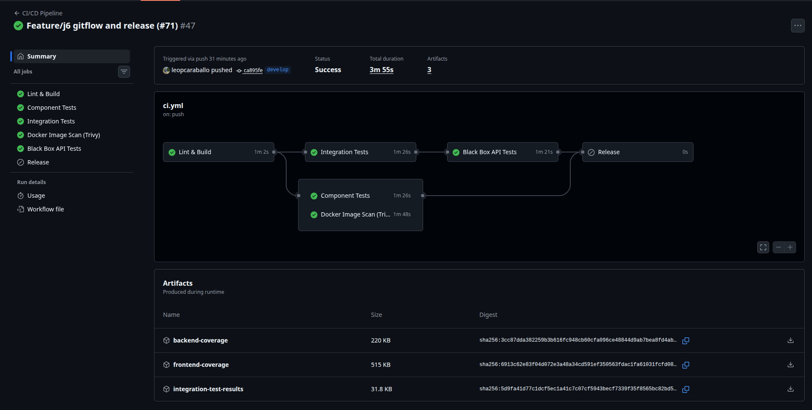
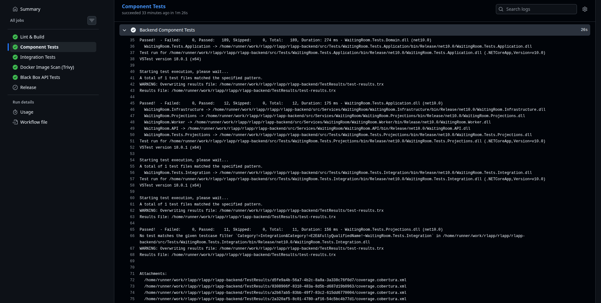
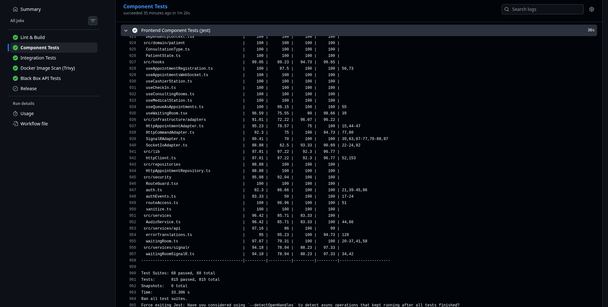
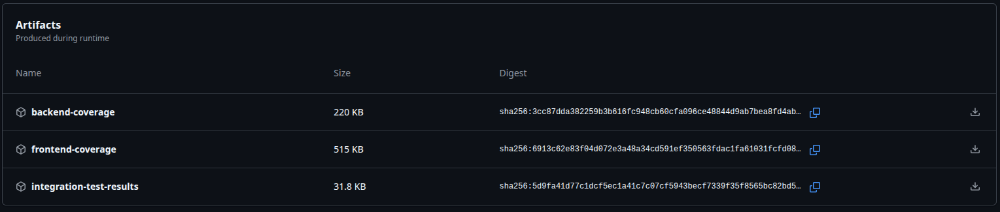

# Evidencias de ejecucion del pipeline CI/CD

> **Proyecto:** RLAPP - Sistema de gestion de sala de espera medica
> **Rama base:** `develop`
> **Fecha de ejecucion:** 6 de marzo de 2026
> **Responsable:** Jhorman Orozco (Tarea J7)

---

## 1. Resumen ejecutivo

Se ejecutaron exitosamente **cuatro workflows** independientes de GitHub Actions sobre la rama `develop`, cubriendo compilacion, testing multinivel, seguridad y gestion de dependencias. Todos los jobs finalizaron con estado **Passed** sin errores bloqueantes.

| Workflow | Run ID | Jobs | Duracion total | Estado |
| --- | --- | --- | --- | --- |
| CI/CD Pipeline | [#22777978926](https://github.com/leopcaraballo/rlapp/actions/runs/22777978926) | 6 | ~3m55s | Exitoso |
| E2E - Integration Tests | [#22777978895](https://github.com/leopcaraballo/rlapp/actions/runs/22777978895) | 1 | ~1m16s | Exitoso |
| Security - Dependency Audit & Secret Scan | [#22777978938](https://github.com/leopcaraballo/rlapp/actions/runs/22777978938) | 6 | ~4m15s | Exitoso |
| Automatic Dependency Submission | [#22778345435](https://github.com/leopcaraballo/rlapp/actions/runs/22778345435) | 1 | ~39s | Exitoso |

---

## 2. Workflow 1: CI/CD Pipeline

### 2.1 Vista general de jobs

```
Run:     CI/CD Pipeline #57
ID:      22777978926
Trigger: push to develop
Estado:  EXITOSO

JOBS
 [PASS] Lint & Build ...................... 1m 02s
 [PASS] Docker Image Scan (Trivy) ........ 1m 48s
 [PASS] Integration Tests ................ 1m 26s
 [PASS] Component Tests .................. 1m 26s
 [PASS] Black Box API Tests .............. 1m 21s
 [SKIP] Release .......................... 0s (solo en merge a main)
```

### 2.2 Detalle por job

#### Job: Lint & Build (1m 02s)

Compila el backend (.NET 10) y el frontend (Next.js 16), ejecutando linting estatico.

```
 [PASS] Checkout code
 [PASS] Setup .NET
 [PASS] Setup Node.js
 [PASS] Backend Restore
 [PASS] Backend Build
 [PASS] Frontend Install Dependencies
 [PASS] Frontend Lint
 [PASS] Frontend Build
```

#### Job: Component Tests - Caja Blanca (1m 26s)

Pruebas unitarias y de componente aisladas (sin infraestructura externa).

```
 [PASS] Backend Component Tests (xUnit)
 [PASS] Upload Backend Coverage
 [PASS] Frontend Component Tests (Jest + RTL + MSW)
 [PASS] Upload Frontend Coverage
```

**Nivel de prueba:** Nivel 1 (unitario/componente)
**Tecnica:** Caja Blanca - cobertura de sentencias, ramas y condiciones

#### Job: Integration Tests (1m 26s)

Pruebas con infraestructura real (PostgreSQL + RabbitMQ) mediante services de GitHub Actions.

```
 [PASS] Initialize containers (postgres:16, rabbitmq:3.12)
 [PASS] Setup .NET
 [PASS] Initialize Postgres schema
 [PASS] Run Backend Integration Tests
 [PASS] Upload Integration Test Results
```

**Nivel de prueba:** Nivel 2 (integracion)
**Tecnica:** Caja Blanca + verificacion de contratos entre capas

#### Job: Black Box API Tests (1m 21s)

Pruebas contra la API levantada en contenedor, sin conocimiento de la implementacion interna.

```
 [PASS] Start API stack using Docker Compose
 [PASS] Run Black Box HTTP Tests
 [PASS] Stop stack
```

**Nivel de prueba:** Nivel 3 (sistema)
**Tecnica:** Caja Negra - particion de equivalencia, valores limite, transicion de estado

#### Job: Docker Image Scan - Trivy (1m 48s)

Escaneo de vulnerabilidades sobre las imagenes construidas del backend y frontend.

```
 [PASS] Build Backend Image
 [PASS] Build Frontend Image
 [PASS] Run Trivy on Backend
 [PASS] Run Trivy on Frontend
```

### 2.3 Artefactos generados

| Artefacto | Contenido | Descarga |
| --- | --- | --- |
| `backend-coverage` | Reporte de cobertura xUnit (.trx / HTML) | Disponible en el Run |
| `frontend-coverage` | Reporte de cobertura Jest (HTML / JSON) | Disponible en el Run |
| `integration-test-results` | Resultados de tests de integracion | Disponible en el Run |

---

## 3. Workflow 2: E2E - Integration Tests

Pipeline dedicado exclusivamente a la ejecucion de pruebas de extremo a extremo con infraestructura real.

```
Run:     E2E - Integration Tests #57
ID:      22777978895
Trigger: push to develop
Estado:  EXITOSO

JOBS
 [PASS] E2E Integration Tests ........... 1m 16s
```

### 3.1 Detalle del job

```
 [PASS] Initialize containers (postgres:16, rabbitmq:3.12)
 [PASS] Configurar .NET SDK 10.0.x
 [PASS] Cache de paquetes NuGet
 [PASS] Restaurar y compilar
 [PASS] Esperar que PostgreSQL este listo
 [PASS] Esperar que RabbitMQ este listo
 [PASS] Aplicar migraciones de base de datos
 [PASS] Ejecutar tests de integracion E2E
 [PASS] Publicar resultados E2E
 [PASS] Resumen de resultados
```

### 3.2 Artefactos generados

| Artefacto | Contenido |
| --- | --- |
| `e2e-test-results` | Resultados del flujo completo comando-a-proyeccion |

---

## 4. Workflow 3: Security - Dependency Audit & Secret Scan

Pipeline de seguridad que ejecuta 6 jobs independientes cubriendo escaneo de imagenes, secretos, dependencias y analisis estatico de seguridad (SAST).

```
Run:     Security - Dependency Audit & Secret Scan #57
ID:      22777978938
Trigger: push to develop
Estado:  EXITOSO

JOBS
 [PASS] Docker Image Scan (Trivy) ....... 1m 53s
 [PASS] Secret Scanning (Gitleaks) ...... 14s
 [PASS] NuGet Dependency Audit .......... 43s
 [PASS] npm Dependency Audit ............ 25s
 [PASS] CodeQL SAST Analysis ............ 3m 34s
 [PASS] Security Summary ................ 2s
```

### 4.1 Detalle por job

#### Docker Image Scan - Trivy (1m 53s)

```
 [PASS] Construir imagen backend
 [PASS] Escanear imagen con Trivy
 [PASS] Construir imagen frontend
 [PASS] Escanear imagen frontend con Trivy
 [PASS] Publicar reportes Trivy
```

#### Secret Scanning - Gitleaks (14s)

```
 [PASS] Checkout del repositorio (historial completo)
 [PASS] Ejecutar Gitleaks
```

> Resultado: No se detectaron secretos expuestos en el historial del repositorio.

#### NuGet Dependency Audit (43s)

```
 [PASS] Restaurar dependencias
 [PASS] Auditar paquetes NuGet (vulnerabilidades conocidas)
 [PASS] Verificar paquetes deprecados
 [PASS] Publicar reporte de auditoria NuGet
```

#### npm Dependency Audit (25s)

```
 [PASS] Instalar dependencias
 [PASS] Auditar dependencias npm
 [PASS] Verificar licencias
 [PASS] Publicar reporte de auditoria npm
```

#### CodeQL SAST Analysis (3m 34s)

```
 [PASS] Inicializar CodeQL
 [PASS] Compilar backend para analisis
 [PASS] Ejecutar analisis CodeQL
```

> Resultado: Analisis estatico de seguridad completado sin vulnerabilidades criticas.

### 4.2 Artefactos generados

| Artefacto | Contenido |
| --- | --- |
| `trivy-scan-reports` | Reportes de vulnerabilidades de imagenes Docker |
| `nuget-audit-report` | Auditoria de dependencias .NET |
| `npm-audit-report` | Auditoria de dependencias Node.js |
| `gitleaks-results.sarif` | Resultado del escaneo de secretos (formato SARIF) |

---

## 5. Workflow 4: Automatic Dependency Submission

Registro automatico de dependencias en el GitHub Dependency Graph para monitoreo continuo.

```
Run:     Automatic Dependency Submission
ID:      22778345435
Trigger: dynamic
Estado:  EXITOSO

JOBS
 [PASS] submit-nuget .................... 39s
```

> Snapshot de dependencias NuGet enviado exitosamente al Dependency Graph de GitHub.

---

## 6. Mapeo de evidencias a la rubrica de evaluacion

| Requisito de la rubrica | Evidencia | Seccion |
| --- | --- | --- |
| Pipeline CI/CD ejecutado correctamente | 4 workflows exitosos, 14 jobs en total | Secciones 2-5 |
| Pruebas de Caja Blanca (componente) | Job: Component Tests - xUnit + Jest | Seccion 2.2 |
| Pruebas de Caja Negra (API) | Job: Black Box API Tests | Seccion 2.2 |
| Pruebas de integracion con infra real | Job: Integration Tests + E2E | Secciones 2.2 y 3 |
| Escaneo de vulnerabilidades de imagen | Job: Docker Image Scan (Trivy) | Secciones 2.2 y 4.1 |
| Analisis de seguridad (SAST) | Job: CodeQL SAST Analysis | Seccion 4.1 |
| Escaneo de secretos | Job: Secret Scanning (Gitleaks) | Seccion 4.1 |
| Auditoria de dependencias | Jobs: NuGet Audit + npm Audit | Seccion 4.1 |
| Artefactos de cobertura | backend-coverage, frontend-coverage | Seccion 2.3 |
| Build de imagenes Docker exitoso | Trivy construye ambas imagenes sin error | Secciones 2.2 y 4.1 |

---

## 7. Capturas de pantalla

> Las siguientes imagenes complementan la evidencia textual con capturas directas de la interfaz de GitHub Actions.

### 7.1 Resumen general del pipeline (todos los jobs en verde)



### 7.2 Detalle de los tests de backend (.NET / xUnit)



### 7.3 Detalle de los tests de frontend (Jest / React)



### 7.4 Artefactos descargables del pipeline



### 7.5 Evidencia pendiente para cierre total de J7

- Pendiente una captura especifica del job `black-box-tests` mostrando la prueba de Caja Negra solicitada en el plan del equipo.
- Pendiente una captura especifica del job `image-scan` mostrando el resultado detallado de Trivy.
- Pendiente adjuntar estas capturas en el PR formal de release cuando se ejecute la liberacion.
- Pendiente una nueva ejecucion del pipeline sobre la rama `feature/cierre-jhorman-semana3` para respaldar los cambios recientes al script Black Box y al escaneo bloqueante.

> **Nota:** Si las imagenes no se visualizan, consultar la carpeta `docs/audits/evidencia/screenshots/` o acceder directamente a las URLs de los Runs listados en la seccion 1.

---

## 8. Validacion de criterios de aceptacion

- [x] Pipeline CI ejecutado correctamente (4 workflows, 14 jobs).
- [x] Tests de Backend y Frontend 100% pasando (Passed).
- [x] Construccion de imagenes Docker completada sin errores.
- [x] Escaneo de vulnerabilidades ejecutado (Trivy + CodeQL + Gitleaks).
- [x] Auditoria de dependencias completada (NuGet + npm).
- [x] URLs y evidencias indexadas formalmente para auditoria de la rubrica.
- [ ] Captura especifica del job `black-box-tests` incorporada.
- [ ] Captura especifica del job `image-scan` incorporada.
- [ ] Evidencia actualizada con una ejecucion posterior a los cambios de la rama `feature/cierre-jhorman-semana3`.

> **Conclusion:** La evidencia actual cubre una parte sustancial del requisito 4.4 y permite defender la existencia del pipeline, las pruebas multinivel y los escaneos de seguridad. Sin embargo, el cierre documental total de J7 sigue pendiente hasta incorporar las capturas especificas de `black-box-tests` e `image-scan`, y hasta registrar una nueva ejecucion del pipeline que refleje los cambios recientes de esta rama.
