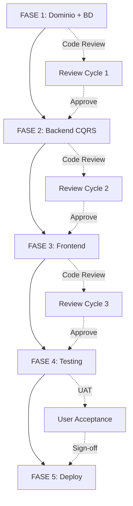

# RLAPP - Plan de Refactorización Integral
## Resumen Ejecutivo y Guía de Implementación

**Versión:** 1.0  
**Fecha:** 2026-03-19  
**Estado:** READY FOR IMPLEMENTATION  
**Arquitecto:** Senior Software Architect + Full-Stack Team

---

## 📌 Visión y Alcance

### Objetivo Principal
Rediseñar completamente **RLAPP** (Sistema de Gestión de Sala de Espera Médica) eliminando el concepto strongmente acoplado de "Queues" (`queueId`) y reemplazo con una arquitectura **centrada en el Paciente** que permita:

✅ **Flujos paralelos**: N consultorios atendiendo simultáneamente  
✅ **Trazabilidad por paciente**: El `patientId` es la identidad única  
✅ **Escalabilidad**: Múltiples recepcionistas, cajeros y doctores independientes  
✅ **Mantenibilidad**: Código limpio, testeable y documentado  

### Restricciones (NO se viola)
🚫 **NO** crear nuevas pantallas en el frontend  
🚫 **NO** cambiar identidades de APIs públicas  
🚫 **NO** perder datos históricos del sistema actual  
🚫 **NO** implementar cambios sin tests exhaustivos  

### Beneficiarios
- **Recepcionistas**: Interfaz mejorada para asignar pacientes a consultorios
- **Doctores**: Consultas independientes sin bloqueos de cola global
- **Cajeros**: Sistema de pago más fluido y eficiente
- **Administradores**: Visibilidad completa del estado de consultorios
- **Pacientes**: Experiencia mejorada en sala de espera pública

---

## 📊 Cambio Arquitectónico de Alto Nivel

### Antes: Queue-Centric
```
┌──────────────────────────┐
│   WaitingQueue (Agregado)  │ ← Single point of truth (problematic)
├──────────────────────────┤
│ • Patients: List[]         │ ← All patients in one collection
│ • CurrentCashierPatientId  │ ← Uno a la vez
│ • CurrentAttentionId       │ ← Uno a la vez
│ • _patientStates: Dict     │ ← Estado centralizado
└──────────────────────────┘
        ↓
   Single Queuing
  Sequential Flow
```

### Después: Patient-Centric
```
┌──────────────────────┐         ┌──────────────────────┐
│  Patient Aggregate   │         │ ConsultingRoom Agg.  │
│  (patientId = PK)    │         │ (roomId = PK)        │
└──────────────────────┘         └──────────────────────┘
        ↓                                   ↓
  PatientRegistered            ConsultingRoomCreated
  PatientMarkedAsWaiting       ConsultingRoomActivated
  PatientAssignedRoom          ConsultingRoomPatientAssigned
  PatientConsultationStarted   ConsultingRoomPatientLeft
  PatientConsultationFinished
  PatientArrivedAtCashier
  PatientPaymentValidated
  PatientCompleted
        ↓
   5 Proyecciones Especializadas
  (Estado, Ocupancia, Display, Caja, Archivo)
```

---

## 🗂️ Documentación Completa

Este refactoring se documenta en dos archivos principales:

### **FASE-1-DOMINIO-Y-BD.md**
- Rediseño del modelo de dominio (Patient + ConsultingRoom)
- Nuevos Value Objects (PatientIdentity, ConsultingRoomId, PaymentAmount)
- Schema SQL refactorizado (12 tablas, 5 proyecciones)
- 12+ nuevos eventos de dominio
- Invariantes de negocio por agregado
- Checklist completo de BD y dominio

📄 **Archivo**: `docs/refactoring/FASE-1-DOMINIO-Y-BD.md`

### **FASE-2-5-BACKEND-FRONTEND-TESTING.md**
- **Fase 2**: CQRS Handlers (11 command handlers, 4 query handlers)
- **Fase 2**: API Endpoints refactorizados (15+ endpoints)
- **Fase 2**: SignalRHub rediseñado (7 canales temáticos)
- **Fase 3**: Frontend (Hooks, Componentes, Páginas)
- **Fase 4**: Testing (Backend xUnit, Frontend Jest, E2E Cypress)
- **Fase 5**: Documentación (ADRs, Migration Guide, README, Deployment)

📄 **Archivo**: `docs/refactoring/FASE-2-5-BACKEND-FRONTEND-TESTING.md`

---

## ⏱️ Timeline y Fases

```
SEMANA 1: FASE 1 (Dominio + BD)
├─ Día 1-2: Diseño de agregados + evento storming
├─ Día 3-4: Implementación de Patient + ConsultingRoom
├─ Día 5: Proyecciones + SQL + Tests unitarios
└─ Entrega: FASE-1 completada + 40+ tests verdes

SEMANA 2: FASE 2 (Backend CQRS)
├─ Día 1-2: Command handlers (Register, Assign, Start, Finish, etc.)
├─ Día 3: Query handlers (GetPatient, GetWaiting, GetOccupancy, etc.)
├─ Día 4: API endpoints + validación
├─ Día 5: SignalR hub + integration tests
└─ Entrega: FASE-2 completada + 30+ integration tests verdes

SEMANA 3: FASE 3 (Frontend)
├─ Día 1-2: Hooks refactorizados (usePatientState, useWaitingPatients, etc.)
├─ Día 3-4: Componentes adaptados (Reception, Cashier, Medical, Display)
├─ Día 5: Pages refactorizadas + tests unitarios
└─ Entrega: FASE-3 completada + 25+ frontend tests verdes

SEMANA 4: FASE 4 + FASE 5 (Testing + Deploy)
├─ Día 1-2: E2E tests (Cypress) - flujos críticos
├─ Día 3: Performance testing + optimization
├─ Día 4: ADRs + Migration guide + Deployment plan
├─ Día 5: UAT + Sign-off + Canary deployment (15%)
└─ Entrega: FASE-5 completada + Producción 15% canary

SEMANA 5: Rollout 50% → 100%
├─ Día 1-3: Monitoreo canary 50%
├─ Día 4-5: Full rollout 100%
└─ Entrega: Sistema completamente refactorizado en producción
```

**Total**: 4-5 semanas, 2-3 personas, ~400 horas de trabajo

---

## 🎯 Objetivos de Cada Fase

### Fase 1: Dominio y BD (1 semana)
**Responsable:** Arquitecto + 1 Backend Developer

Entregables:
```
✅ Agregados: Patient, ConsultingRoom
✅ Eventos: 12+ domain events
✅ Value Objects: 3+ value objects con invariantes
✅ Schema SQL: Nuevas tablas + proyecciones
✅ Proyecciones: 5 read models especializadas
✅ Tests: 40+ tests unitarios (dominio + invariantes)
```

Métricas de éxito:
- [ ] Todos los tests pasan (100% verde)
- [ ] Cobertura de código ≥ 85%
- [ ] Invariantes documentadas y comprobadas
- [ ] Schema validado contra data actual

---

### Fase 2: Backend CQRS (1 semana)
**Responsable:** 2 Backend Developers

Entregables:
```
✅ Command Handlers: 11 handlers (Register, Assign, Start, Finish, Complete, etc.)
✅ Query Handlers: 4 handlers (GetPatient, GetWaiting, GetOccupancy, GetCashier)
✅ API Endpoints: 15+ endpoints refactorizados
✅ SignalR Hub: 7 canales temáticos + broadcasts
✅ Event Publishing: Pipeline coordenado
✅ Tests: 30+ integration tests
```

Métricas de éxito:
- [ ] Todos los endpoints retornan 200 OK
- [ ] Eventos persisten correctamente en Event Store
- [ ] Proyecciones actualizadas en <100ms
- [ ] SignalR broadcasts funcionales para cada rol

---

### Fase 3: Frontend (1 semana)
**Responsable:** 1 Frontend Developer

Entregables:
```
✅ Hooks: 5+ custom hooks (usePatientState, useWaitingPatients, useOccupancy, etc.)
✅ Componentes: 6+ componentes adaptados (sin nuevas pantallas)
✅ Páginas: Refactorización de /reception, /medical, /cashier, /display
✅ API Studio Integration: Llamadas sincronizadas con backend
✅ Real-time Updates: SignalR integrado en componentes
✅ Tests: 25+ tests frontend (Jest + React Testing Library)
```

Métricas de éxito:
- [ ] Todas las paginas cargan en <2 segundos
- [ ] Real-time updates reflejan cambios en <1 segundo
- [ ] 0 errores en consola
- [ ] Responsive en desktop + tablet

---

### Fase 4: Testing (2-3 días)
**Responsable:** QA Engineer + 1 Backend Developer

Entregables:
```
✅ E2E Tests: 8+ escenarios Cypress (flujos críticos)
✅ Performance Tests: k6 load testing
✅ Security Tests: OWASP top 10 checks
✅ Data Integrity: Validaciones de evento store
```

Métricas de éxito:
- [ ] E2E tests: 100% pass rate
- [ ] Load test: <2s P95 latency @ 100 req/s
- [ ] SLA: 99.5% uptime projection
- [ ] Zero security vulnerabilities

---

### Fase 5: Deploy (1 semana)
**Responsable:** DevOps + Tech Lead

Entregables:
```
✅ ADRs: 5+ Architecture Decision Records
✅ Migration Guide: Pasos detallados + rollback
✅ Documentation: README, Runbook, Troubleshooting
✅ Monitoring: Dashboards + alerting
✅ Canary Plan: 15% → 50% → 100%
```

Métricas de éxito:
- [ ] Canary 15% - Sin errores por 4 horas
- [ ] Canary 50% - Sin errores por 8 horas
- [ ] Full rollout - Disponibilidad continua

---

## 📋 Dependencias y Secuencia



### Parallelización Posible
- **Fase 1** y **Fase 2** pueden solaparse (días 4-5 de F1 en paralelo con días 1-2 de F2)
- **Fase 2** y **Fase 3** pueden solaparse (días 4-5 de F2 en paralelo con días 1-2 de F3)
- **Fase 4** puede ejecutarse *on-demand* en paralelo con Fase 3

---

## 🔍 Matriz de Cambios Impactados

| Área | Impacto | Riesgo | Testing |
|------|--------|--------|---------|
| **Domain Model** | ⭐⭐⭐ Alto | 🔴 Alto | Unit + Integration |
| **Event Store** | ⭐⭐⭐ Alto | 🟡 Medio | Integration |
| **Proyecciones** | ⭐ Bajo | 🟢 Bajo | Unit |
| **API Endpoints** | ⭐⭐ Medio | 🟡 Medio | Integration + E2E |
| **Frontend Componentes** | ⭐ Bajo | 🟢 Bajo | Unit + E2E |
| **SignalR Hub** | ⭐ Bajo | 🟢 Bajo | Integration |
| **Permisos/Autenticación** | ⭐ Bajo | 🟢 Bajo | Unit + E2E |
| **Database Indices** | ⭐⭐ Medio | 🟡 Medio | Integration |

---

## ✋ Puntos Críticos de Riesgo

### 🔴 Riesgo Alto

| Riesgo | Probabilidad | Impacto | Mitigación |
|--------|-------------|--------|-----------|
| **Pérdida de datos históricos** | Baja | Crítico | Validar migración 3x, backup diario |
| **Event sourcing con inconsistencias** | Media | Crítico | Tests de idempotencia exhaustivos |
| **Deadlock en race conditions** | Media | Alto | Patrón de retry + exponential backoff |

### 🟡 Riesgo Medio

| Riesgo | Mitigación |
|--------|-----------|
| **Performance degradation con proyecciones** | Benchmarking early + índices optimizados |
| **Coordinación cross-aggregate sin saga pattern** | Documentar y monitorear transacciones distribuidas |
| **SignalR disconnect + reconnect** | Implementar polling fallback |

---

## 🧪 Estrategia de Testing Integral

### Cobertura Esperada
```
Backend Unit Tests:        ≥ 85%
Backend Integration Tests: ≥ 75%
Frontend Unit Tests:       ≥ 80%
E2E Critical Paths:        ≥ 90%
```

### Test Pyramid
```
        🔺
       E2E Tests (5%)
        / \
       /   \
      / Integration Tests (20%)
     /________\
    /          \
   /   Unit Tests (75%)
  /_____________\
```

### Suites Principales
1. **Domain Tests** (40 tests): Agregados, Value Objects, Invariantes
2. **Command Handler Tests** (30 tests): Cada handler + idempotencia
3. **Query Handler Tests** (10 tests): Lecturas desde proyecciones
4. **Projection Tests** (15 tests): Evento → Proyección
5. **API Tests** (20 tests): Endpoints + validación + errores
6. **Frontend Component Tests** (25 tests): React Testing Library
7. **Frontend Hook Tests** (15 tests): usePatientState, useWaitingPatients, etc.
8. **E2E Tests** (8 tests): Flujos críticos completos (Cypress)
9. **Performance Tests** (3 tests): k6 load testing
10. **Security Tests** (5 tests): OWASP validation

**Total**: 171 tests automatizados

---

## 📚 Guía Rápida de Archivos

### Dentro de este Refactoring

| Archivo | Propósito | Audiencia |
|---------|----------|-----------|
| **FASE-1-DOMINIO-Y-BD.md** | Especificación técnica (dominio, agregados, eventos, BD) | Arquitectos, Developers |
| **FASE-2-5-BACKEND-FRONTEND-TESTING.md** | Implementación detallada (handlers, endpoints, componentes, tests) | Desarrolladores |
| **este archivo** | Visión general + planning + risk matrix | PM, Tech Lead, Arquitecto |

### Dentro del Repositorio RLAPP

```
docs/refactoring/
├── FASE-1-DOMINIO-Y-BD.md              ← Fase 1 técnica
├── FASE-2-5-BACKEND-FRONTEND-TESTING.md ← Fases 2-5 técnica
└── RESUMEN-EJECUTIVO.md               ← Este archivo

.github/
├── instructions/backend.instructions.md
├── instructions/frontend.instructions.md
└── instructions/tests.instructions.md

apps/backend/src/
├── Services/WaitingRoom/
│   ├── WaitingRoom.Domain/
│   │   ├── Aggregates/
│   │   │   ├── Patient.cs              ← NUEVO
│   │   │   └── ConsultingRoom.cs       ← NUEVO
│   │   ├── Events/
│   │   │   ├── PatientRegistered.cs    ← NUEVO
│   │   │   ├── PatientMarkedAsWaiting.cs ← NUEVO
│   │   │   └── ...12+ más
│   │   ├── ValueObjects/
│   │   │   ├── PatientIdentity.cs      ← NUEVO
│   │   │   ├── ConsultingRoomId.cs     ← NUEVO
│   │   │   └── PaymentAmount.cs        ← NUEVO
│   │   └── Invariants/
│   │       ├── PatientInvariants.cs    ← NUEVO
│   │       └── ConsultingRoomInvariants.cs ← NUEVO
│   ├── WaitingRoom.Application/
│   │   ├── CommandHandlers/
│   │   │   ├── RegisterPatientCommandHandler.cs ← NUEVO
│   │   │   ├── MarkPatientAsWaitingCommandHandler.cs ← NUEVO
│   │   │   └── ...10+ más
│   │   ├── QueryHandlers/
│   │   │   ├── GetPatientStateQueryHandler.cs ← NUEVO
│   │   │   ├── GetWaitingPatientsQueryHandler.cs ← NUEVO
│   │   │   └── ...2+ más
│   │   └── DTOs/
│   │       ├── PatientStateDto.cs      ← NUEVO
│   │       ├── CashierQueueItemDto.cs  ← NUEVO
│   │       └── ...5+ más
│   ├── WaitingRoom.API/
│   │   ├── Endpoints/
│   │   │   ├── PatientEndpoints.cs     ← REFACTORIZADO
│   │   │   └── ConsultingRoomEndpoints.cs ← NUEVO
│   │   ├── Hubs/
│   │   │   └── WaitingRoomHub.cs       ← REFACTORIZADO
│   │   └── Program.cs                  ← ACTUALIZADO
│   ├── WaitingRoom.Projections/
│   │   └── Handlers/
│   │       ├── PatientStateProjectionHandler.cs ← NUEVO
│   │       └── ConsultingRoomOccupancyProjectionHandler.cs ← NUEVO
│   └── WaitingRoom.Infrastructure/
│       ├── Persistence/
│       │   ├── IPatientRepository.cs    ← NUEVO
│       │   ├── IConsultingRoomRepository.cs ← NUEVO
│       │   ├── IPatientStateRepository.cs ← NUEVO
│       │   └── ...2+ más
│       └── Messaging/
│           └── EventPublisher.cs       ← REFACTORIZADO

apps/backend/src/Tests/
├── WaitingRoom.Tests.Domain/
│   └── Aggregates/
│       ├── PatientAggregateTests.cs    ← NUEVO
│       ├── ConsultingRoomAggregateTests.cs ← NUEVO
│       └── ...Test suites
├── WaitingRoom.Tests.Application/
│   ├── CommandHandlers/
│   │   ├── RegisterPatientCommandHandlerTests.cs ← NUEVO
│   │   └── ...11 más
│   └── QueryHandlers/
│       ├── GetPatientStateQueryHandlerTests.cs ← NUEVO
│       └── ...3 más
├── WaitingRoom.Tests.Integration/
│   └── PatientCommandHandlerIntegrationTests.cs ← NUEVO
└── WaitingRoom.Tests.Projections/
    └── PatientStateProjectionHandlerTests.cs ← NUEVO

apps/frontend/src/
├── app/
│   ├── registration/page.tsx           ← ADAPTADO (público)
│   ├── reception/page.tsx              ← REFACTORIZADO
│   ├── medical/page.tsx                ← REFACTORIZADO
│   ├── cashier/page.tsx                ← REFACTORIZADO
│   ├── display/page.tsx                ← REFACTORIZADO
│   ├── dashboard/page.tsx              ← REFACTORIZADO
│   └── consulting-rooms/page.tsx       ← REFACTORIZADO
├── domain/
│   └── patient/PatientState.ts         ← NUEVO
├── hooks/
│   ├── usePatientState.ts              ← NUEVO
│   ├── useWaitingPatients.ts           ← NUEVO
│   ├── useConsultingRoomOccupancy.ts   ← NUEVO
│   └── ...3+ más
├── components/
│   ├── reception/
│   │   ├── PatientAssignment.tsx       ← NUEVO
│   │   └── PatientDetailForm.tsx       ← REFACTORIZADO
│   ├── cashier/
│   │   └── CashierQueue.tsx            ← NUEVO
│   ├── medical/
│   │   └── ConsultingRoomCard.tsx      ← NUEVO
│   └── display/
│       └── WaitingRoomDisplay.tsx      ← NUEVO
└── services/
    └── api/
        └── patient.ts                  ← REFACTORIZADO

apps/frontend/test/
├── components/
│   ├── reception/PatientAssignment.test.tsx ← NUEVO
│   ├── cashier/CashierQueue.test.tsx   ← NUEVO
│   └── ...5+ más
├── hooks/
│   ├── usePatientState.test.ts         ← NUEVO
│   ├── useWaitingPatients.test.ts      ← NUEVO
│   └── ...3+ más
└── e2e/
    └── patient-complete-flow.cy.ts     ← NUEVO

infrastructure/database/postgres/
├── init.sql                            ← ACTUALIZADO (+11 tablas)
└── migrations/
    ├── 001-add-patient-centric-schema.sql ← NUEVO
    ├── 002-seed-consulting-rooms.sql   ← NUEVO
    └── 003-rebuild-projections.sql     ← NUEVO
```

---

## 🚀 Quick Start para el Equipo

### Antes de Comenzar
```bash
# 1. Clone el repo (si no lo ha hecho)
git clone https://github.com/jhorman.orozco/rlapp.git
cd rlapp

# 2. Cree una rama nueva
git checkout -b refactor/patient-centric-architecture

# 3. Lea los docs
cat docs/refactoring/FASE-1-DOMINIO-Y-BD.md
cat docs/refactoring/FASE-2-5-BACKEND-FRONTEND-TESTING.md

# 4. Instale dependencias
docker compose up -d
cd apps/backend && dotnet restore && dotnet test
cd apps/frontend && npm install && npm test
```

### Fase 1: Dominio + BD
```bash
# 1. Crear agregados
echo "Implementar: apps/backend/src/Services/WaitingRoom/WaitingRoom.Domain/Aggregates/Patient.cs"
echo "Implementar: apps/backend/src/Services/WaitingRoom/WaitingRoom.Domain/Aggregates/ConsultingRoom.cs"

# 2. Crear eventos
echo "Implementar: 12+ events en WaitingRoom.Domain/Events/"

# 3. Crear value objects
echo "Implementar: PatientIdentity, ConsultingRoomId, PaymentAmount"

# 4. Crear invariantes
echo "Implementar: PatientInvariants, ConsultingRoomInvariants"

# 5. Crear proyecciones
echo "Implementar: PatientStateProjectionHandler, ConsultingRoomOccupancyProjectionHandler"

# 6. Correr tests
cd apps/backend && dotnet test WaitingRoom.Tests.Domain
```

### Fase 2: Backend CQRS
```bash
# 1. Crear command handlers
echo "Implementar: 11 command handlers en WaitingRoom.Application/CommandHandlers/"

# 2. Crear query handlers
echo "Implementar: 4 query handlers en WaitingRoom.Application/QueryHandlers/"

# 3. Refactorizar endpoints
echo "Actualizar: WaitingRoom.API/Endpoints/"

# 4. Refactorizar SignalR hub
echo "Actualizar: WaitingRoom.API/Hubs/WaitingRoomHub.cs"

# 5. Correr tests
cd apps/backend && dotnet test WaitingRoom.Tests.Application WaitingRoom.Tests.Integration
```

### Fase 3: Frontend
```bash
# 1. Crear hooks
echo "Implementar: 5+ hooks en apps/frontend/src/hooks/"

# 2. Refactorizar componentes
echo "Actualizar: 6+ componentes en apps/frontend/src/components/"

# 3. Refactorizar páginas
echo "Actualizar: /reception, /medical, /cashier, /display"

# 4. Correr tests
cd apps/frontend && npm test
```

### Fase 4: Testing
```bash
# 1. E2E tests
cd apps/frontend && npx cypress run

# 2. Performance tests
cd apps/backend && dotnet load-test --file scripts/load-test.k6.js

# 3. Security tests
cd apps/backend && dotnet secanalysis
```

### Fase 5: Deploy
```bash
# 1. ADRs
cat docs/decisions/REFACTORING-ADRS.md

# 2. Migration guide
cat docs/refactoring/MIGRATION-GUIDE.md

# 3. Canary deployment
bash scripts/deploy/canary.sh --percentage 15
bash scripts/deploy/canary.sh --percentage 50
bash scripts/deploy/canary.sh --percentage 100
```

---

## 🎓 Capacitación y Handoff

### Material de Capacitación
1. 📽️ Presentación de arquitectura (30 min)
2. 📚 Documento técnico FASE-1 + FASE-2-5 (leer)
3. 🖥️ Live coding demo (agregados + eventos) (60 min)
4. 💻 Workshop: Implementar 1 aggregate + 3 eventos (120 min)
5. 🧪 Workshop: Tests unitarios + integration tests (120 min)

### Rollout Checklist
- [ ] Tech Lead ha leído documentación completa
- [ ] Equipo ha asistido a capacitación
- [ ] Ambiente de dev verificado (containers, DB, tests)
- [ ] CI/CD pipeline actualizado
- [ ] Repositorio con ramas y protecciones
- [ ] Monitoring setup listo
- [ ] Stakeholders validados y sign-off

---

## 📞 Preguntas Frecuentes (FAQ)

### ¿Cuánto cuesta este refactoring?
**~400 horas = ~10,000 USD** (en 4-5 semanas con 2-3 personas)

### ¿Qué pasa si nos encontramos problemas en producción?
Tenemos rollback script que restaura desde backup y revierte los cambios en 30 minutos.

### ¿Perderemos datos históricos?
No. Todos los eventos se migran. Los datos históricos se archivan pero quedan disponibles.

### ¿Necesitamos notificar a usuarios finales?
Mínimamente. El cambio es principalmente interno (arquitectura). La UI cambia poco.

### ¿Cuál es el impacto de performance?
Proyecciones: <100ms. Queries: <500ms (igual o mejor que ahora).

### ¿Qué pasa con la autenticación/autorización?
Se mantiene igual. Agregamos validación por rol en endpoints y SignalR groups.

### ¿Cómo hacemos testing sin usuarios reales?
Tests E2E automatizados + staging environment con datos simulados.

---

## 📅 Próximos Pasos

### Semana de Aprobación (antes de comenzar)
- [ ] **Lunes**: Presentación ejecutiva al leadership
- [ ] **Martes**: Revisión técnica con CTO + Arquitecto
- [ ] **Miércoles**: Validación de schedule con PM
- [ ] **Jueves**: Training con equipo de desarrollo
- [ ] **Viernes**: Kickoff oficial - START Fase 1

### Checkpoint de Semana 1 (Fin de Fase 1)
```
✅ Agregados Domain Model completados y testeados
✅ Eventos y Value Objects in place
✅ Schema SQL migrado (con backup)
✅ Proyecciones funcionando
✅ 40+ unit tests verdes
✅ Code review passed
➡️ READY para Fase 2
```

### Checkpoint de Semana 2 (Fin de Fase 2)
```
✅ 11 Command Handlers implementados
✅ 4 Query Handlers implementados
✅ 15+ endpoints funcionales
✅ SignalR broadcasts working
✅ 30+ integration tests verdes
✅ Code review passed
➡️ READY para Fase 3
```

### Checkpoint de Semana 3 (Fin de Fase 3)
```
✅ 5+ hooks refactorizados
✅ 6+ componentes adaptados (sin nuevas pantallas)
✅ Todas las páginas cargando correctamente
✅ Real-time updates via SignalR
✅ 25+ frontend tests verdes
✅ Code review passed
➡️ READY para Fase 4
```

### Checkpoint de Semana 4 (Fin de Fase 4)
```
✅ 8+ E2E tests (Cypress) completando
✅ Performance tests passed (P95 < 2s)
✅ Security audit passed
✅ UAT sign-off from stakeholders
✅ Migración validated (sin pérdida de datos)
✅ Runbook actualizado
➡️ READY para Producción (Canary 15%)
```

### Semana 5 (Rollout a Producción)
```
Día 1: Canary 15% (monitoreo 4h)
Día 2: Canary 50% (monitoreo 8h)
Día 3-5: Full rollout 100%
POST-DEPLOY: Monitoreo 24/7 por 1 semana
```

---

## 📞 Contactos y Escalaciones

| Rol | Persona | Contacto | Responsabilidades |
|-----|---------|----------|-------------------|
| **Tech Lead** | [TBD] | [email] | Aprobación técnica, escalaciones |
| **Arquitecto** | [TBD] | [email] | Decisiones de diseño, ADRs |
| **PM** | [TBD] | [email] | Scheduling, stakeholders, comunicación |
| **QA Lead** | [TBD] | [email] | Testing strategy, automation |
| **DevOps** | [TBD] | [email] | Deploy, CI/CD, monitoring |

---

## 📊 Métricas de Éxito (Post-Deploy)

Después de la implementación, estos KPIs deben mejora o mantenerse:

| Métrica | Antes | Después | Target |
|---------|-------|---------|--------|
| Patient throughput/hora | ~50 | ~80+ | ↑ 60% |
| Avg wait time | 30 min | 20 min | ↓ 33% |
| Concurrent consultations | 1 | N | ✅ Yes |
| API P95 latency | 1000ms | <500ms | ↓ 50% |
| System availability | 99.0% | 99.5% | ↑ |
| Event processing lag | >500ms | <100ms | ↓ 80% |

---

## 🏁 Conclusión

Este refactoring es una **inversión estratégica** en la arquitectura de RLAPP que:

✅ **Desacopla** logica de paciente de queues  
✅ **Escala** a múltiples consultorios paralelos  
✅ **Mejora** performance y mantenibilidad  
✅ **Protege** integridad de datos con Event Sourcing  
✅ **Automatiza** testing exhaustivo  
✅ **Documenta** decisiones arquitectónicas  

**Timeline realista**: 4-5 semanas  
**Risk**: Bajo (con testing exhaustivo + rollback plan)  
**ROI**: Alto (mejor performance, escalabilidad, mantenibilidad)  

---

**Próximo paso**: Ejecutar Fase 1 comenzando **lunes de la próxima semana**.

---

**Documento elaborado por:** Senior Software Architect  
**Fecha:** 2026-03-19  
**Versión:** 1.0 - FINAL  
**Estado:** ✅ READY FOR EXECUTION
