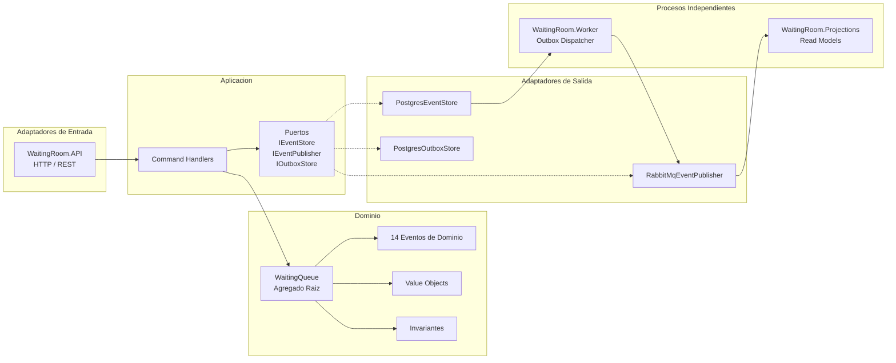

# RLAPP Backend

## 1. Purpose

Sistema de gestion de sala de espera medica. Administra el flujo de pacientes desde el registro (check-in) hasta la finalizacion de la atencion, incluyendo estaciones de taquilla y consultorios. Implementa Event Sourcing como modelo de persistencia, CQRS para separacion de lectura y escritura, y Outbox Pattern para entrega confiable de eventos. El bounded context principal es `WaitingRoom`. El dominio gestiona prioridades (Low, Medium, High, Urgent), control de ausencias, validacion de pagos y asignacion de pacientes a consultorios. La arquitectura sigue el patron hexagonal con separacion estricta entre dominio, aplicacion, infraestructura y adaptadores de entrada.

## 2. Context

### Stack tecnologico

| Componente | Tecnologia | Version |
|---|---|---|
| Plataforma | .NET | 10.0 |
| Lenguaje | C# | 13+ |
| API | ASP.NET Core Minimal API | 10.0 |
| Persistencia | PostgreSQL | 16+ |
| Driver BD | Npgsql | 8.0.5 |
| Micro-ORM | Dapper | 2.1.35 |
| Messaging | RabbitMQ | 3-management |
| Cliente AMQP | RabbitMQ.Client | 6.8.1 |
| Serializacion | Newtonsoft.Json | 13.0.3 |
| Logging | Serilog | 4.2.0 |
| Log server | Seq | Docker |
| Metricas | Prometheus | Docker |
| Dashboards | Grafana | Docker |
| Testing | xUnit | 2.6.2 - 2.9.3 |
| Aserciones | FluentAssertions | 6.12.0 - 8.8.0 |
| Contenedorizacion | Docker / Docker Compose | - |

### Diagrama de arquitectura hexagonal (simplificado)



## 3. Technical Details

### Estructura del repositorio

```
rlapp-backend/
├── RLAPP.slnx
├── Dockerfile
├── docker-compose.yml
├── .env.template
├── start-services.sh
├── run-complete-test.sh
│
├── infrastructure/
│   ├── postgres/
│   │   └── init.sql
│   ├── rabbitmq/
│   │   ├── rabbitmq.conf
│   │   └── init-rabbitmq.sh
│   ├── prometheus/
│   │   ├── prometheus.yml
│   │   └── alert-rules.yml
│   └── grafana/
│       ├── provisioning/
│       └── dashboards/
│
├── src/
│   ├── BuildingBlocks/
│   │   ├── BuildingBlocks.EventSourcing/
│   │   ├── BuildingBlocks.Messaging/
│   │   └── BuildingBlocks.Observability/
│   │
│   ├── Services/WaitingRoom/
│   │   ├── WaitingRoom.Domain/
│   │   ├── WaitingRoom.Application/
│   │   ├── WaitingRoom.Infrastructure/
│   │   ├── WaitingRoom.API/
│   │   ├── WaitingRoom.Projections/
│   │   └── WaitingRoom.Worker/
│   │
│   └── Tests/
│       ├── WaitingRoom.Tests.Domain/
│       ├── WaitingRoom.Tests.Application/
│       ├── WaitingRoom.Tests.Integration/
│       └── WaitingRoom.Tests.Projections/
```

### Modelo de despliegue

| Servicio | Rol | Puerto |
|---|---|---|
| WaitingRoom.API | Comandos HTTP, queries, WebSocket hub | 5000 |
| WaitingRoom.Worker | Outbox dispatcher (despacha eventos a RabbitMQ) | - |
| WaitingRoom.Projections | Consume eventos de RabbitMQ, actualiza read models | - |
| PostgreSQL | Event Store, Outbox, Read Models | 5432 |
| RabbitMQ | Message Broker (Topic Exchange) | 5672 / 15672 |
| Prometheus | Metricas | 9090 |
| Grafana | Dashboards | 3000 |
| Seq | Logging estructurado | 5341 |

## 4. Operational / Maintenance Notes

### Prerequisitos

| Herramienta | Version minima |
|---|---|
| .NET SDK | 10.0 |
| Docker | 20.10+ |
| Docker Compose | 2.0+ |

### Quick start (Docker Compose)

```bash
cd rlapp-backend/
cp .env.template .env
docker-compose up -d

curl http://localhost:5000/health/live
curl http://localhost:5000/health/ready
```

### Quick start (desarrollo local)

```bash
# 1. Iniciar infraestructura
docker-compose up -d postgres rabbitmq seq

# 2. Esperar a que PostgreSQL este listo (~15 segundos)

# 3. Iniciar API
cd src/Services/WaitingRoom/WaitingRoom.API
dotnet run --urls "http://0.0.0.0:5000"

# 4. En otra terminal: iniciar Worker
cd src/Services/WaitingRoom/WaitingRoom.Worker
dotnet run

# 5. En otra terminal: iniciar Projections
cd src/Services/WaitingRoom/WaitingRoom.Projections
dotnet run
```

### Ejecucion de tests

```bash
# Tests unitarios (sin infraestructura)
dotnet test src/Tests/WaitingRoom.Tests.Domain/
dotnet test src/Tests/WaitingRoom.Tests.Application/
dotnet test src/Tests/WaitingRoom.Tests.Projections/

# Tests de integracion (requiere PostgreSQL)
dotnet test src/Tests/WaitingRoom.Tests.Integration/

# Todos los tests
dotnet test RLAPP.slnx
```

### Variables de entorno

| Variable | Descripcion |
|---|---|
| `POSTGRES_USER` | Usuario de PostgreSQL |
| `POSTGRES_PASSWORD` | Contrasena de PostgreSQL |
| `RABBITMQ_DEFAULT_USER` | Usuario de RabbitMQ |
| `RABBITMQ_DEFAULT_PASS` | Contrasena de RabbitMQ |
| `RLAPP_EVENTSTORE_CONNECTION` | Connection string del event store |

Valores por defecto documentados en `.env.template`.

### URLs de administracion

| Servicio | URL |
|---|---|
| API | `http://localhost:5000` |
| RabbitMQ Management | `http://localhost:15672` |
| Prometheus | `http://localhost:9090` |
| Grafana | `http://localhost:3000` |
| Seq | `http://localhost:5341` |
| PgAdmin | `http://localhost:5050` |
