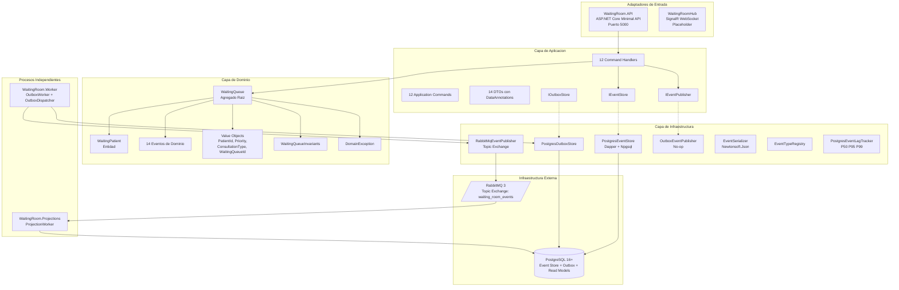
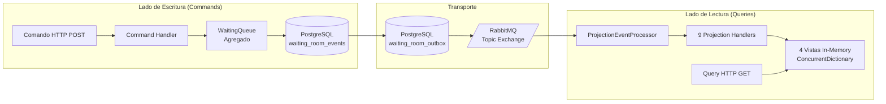
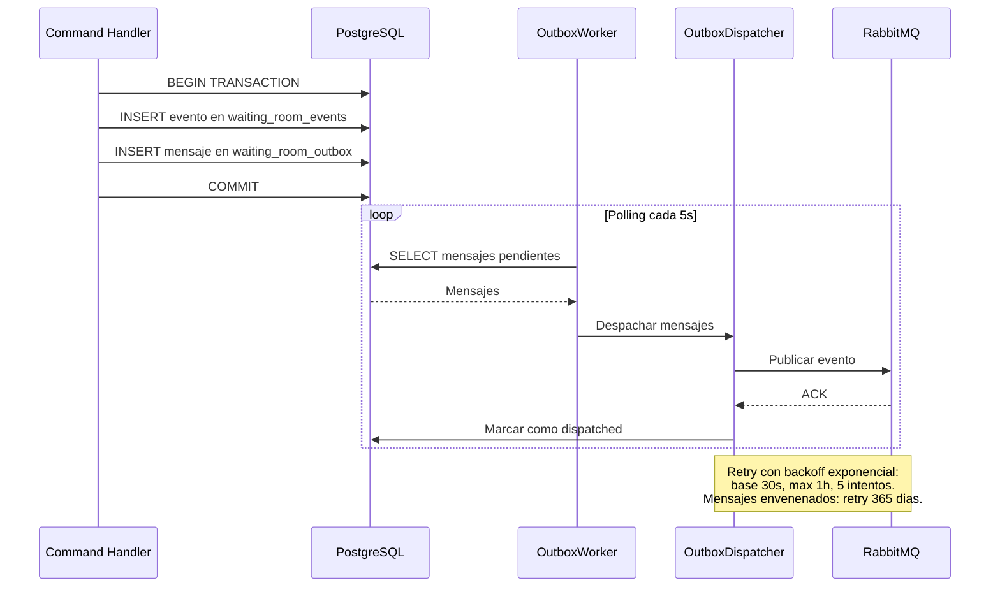

# Architecture

## 1. Purpose

Documentacion tecnica de la arquitectura del backend RLAPP. Describe los patrones arquitectonicos implementados, el bounded context, la maquina de estados del dominio, el catalogo de eventos, y los mecanismos de persistencia y comunicacion entre componentes.

## 2. Context

### Bounded context

El sistema opera bajo un unico bounded context: `WaitingRoom`. Este contexto encapsula la gestion del flujo de pacientes en una sala de espera medica, desde el registro hasta la finalizacion de la atencion.

### Patrones arquitectonicos

| Patron | Descripcion |
|---|---|
| Arquitectura Hexagonal | Separacion en capas: Dominio, Aplicacion, Infraestructura, Adaptadores de entrada |
| Event Sourcing | El estado del agregado se reconstruye a partir del stream de eventos |
| CQRS | Separacion fisica entre el modelo de escritura (event store) y el modelo de lectura (proyecciones) |
| Outbox Pattern | Entrega confiable de eventos al message broker dentro de la misma transaccion |

### Agregado raiz

`WaitingQueue` es el unico agregado del bounded context. Gestiona la lista de pacientes (`WaitingPatient`), consultorios activos, y aplica las invariantes de negocio definidas en `WaitingQueueInvariants`.

## 3. Technical Details

### Diagrama de arquitectura hexagonal (completo)



### Maquina de estados del paciente (13 estados)

```
Registrado
  +-- EnEsperaTaquilla
        +-- EnTaquilla
              |-- PagoValidado -- EnEsperaConsulta
              |     +-- ReclamadoParaAtencion
              |           +-- LlamadoConsulta
              |                 |-- EnConsulta -- Finalizado
              |                 +-- AusenteEnConsulta (1 reintento)
              |                       +-- CanceladoPorAusencia
              |-- PagoPendiente (hasta 3 intentos)
              |     +-- CanceladoPorPago
              +-- AusenteEnTaquilla (hasta 2 reintentos)
                    +-- CanceladoPorAusencia
```

Estados:

1. Registrado
2. EnEsperaTaquilla
3. EnTaquilla
4. PagoValidado
5. PagoPendiente
6. AusenteEnTaquilla
7. CanceladoPorPago
8. EnEsperaConsulta
9. ReclamadoParaAtencion
10. LlamadoConsulta
11. EnConsulta
12. Finalizado
13. CanceladoPorAusencia

### Invariantes de negocio

| Invariante | Parametro |
|---|---|
| Capacidad maxima de la cola | Configurable por cola (`MaxCapacity`) |
| Duplicado de check-in (case-insensitive) | - |
| Ausencias en taquilla | `MaxCashierAbsences = 2` |
| Intentos de pago | `MaxPaymentRetries = 3` |
| Ausencias en consulta | `MaxConsultationAbsences = 1` |
| Consultorio activo requerido para reclamar | - |
| Orden de prioridad en reclamacion | Urgent(4) > High(3) > Medium(2) > Low(1) |
| Transiciones de estado validas | Maquina de estados estricta |

### Escalamiento automatico de prioridad

El `CheckInPatientCommandHandler` eleva la prioridad automaticamente para pacientes embarazadas, menores de 18 anios y mayores de 65 anios.

### Catalogo de eventos de dominio (14 eventos)

| Event Name | Aggregate | Version | Description |
|---|---|---|---|
| `WaitingQueueCreated` | `WaitingQueue` | 1 | Cola de espera creada |
| `PatientCheckedIn` | `WaitingQueue` | 1 | Paciente registrado en la cola |
| `PatientCalledAtCashier` | `WaitingQueue` | 1 | Paciente llamado a taquilla |
| `PatientPaymentValidated` | `WaitingQueue` | 1 | Pago del paciente validado |
| `PatientPaymentPending` | `WaitingQueue` | 1 | Pago del paciente pendiente |
| `PatientAbsentAtCashier` | `WaitingQueue` | 1 | Paciente ausente en taquilla |
| `PatientCancelledByPayment` | `WaitingQueue` | 1 | Paciente cancelado por fallos de pago |
| `PatientClaimedForAttention` | `WaitingQueue` | 1 | Paciente reclamado por un consultorio |
| `PatientCalled` | `WaitingQueue` | 1 | Paciente llamado a consulta |
| `PatientAttentionCompleted` | `WaitingQueue` | 1 | Atencion del paciente finalizada |
| `PatientAbsentAtConsultation` | `WaitingQueue` | 1 | Paciente ausente en consulta |
| `PatientCancelledByAbsence` | `WaitingQueue` | 1 | Paciente cancelado por ausencias |
| `ConsultingRoomActivated` | `WaitingQueue` | 1 | Consultorio activado |
| `ConsultingRoomDeactivated` | `WaitingQueue` | 1 | Consultorio desactivado |

Todos los eventos heredan de `DomainEvent` (record inmutable). Cada evento incluye `EventMetadata` con: `EventId`, `AggregateId`, `Version`, `OccurredAt`, `CorrelationId`, `CausationId`, `IdempotencyKey`, `Actor`, `SchemaVersion`.

### CQRS



Escritura: Los comandos HTTP ingresan a traves de los endpoints POST. Cada command handler carga el agregado mediante `IEventStore.LoadAsync`, ejecuta la operacion de dominio que genera eventos, y persiste los eventos atomicamente en `waiting_room_events` junto con el registro de outbox en `waiting_room_outbox`.

Lectura: Los eventos se transportan via Outbox + RabbitMQ hacia el servicio de proyecciones. El `ProjectionEventProcessor` delega a los 9 handlers de proyeccion, que actualizan las vistas en memoria. Los endpoints GET leen directamente de estas vistas.

### Event Store

PostgreSQL actua como event store. La tabla `waiting_room_events` almacena todos los eventos del agregado con indices unicos en `(aggregate_id, version)` e `(idempotency_key)`. El estado del agregado `WaitingQueue` se reconstruye aplicando secuencialmente los eventos del stream. Se implementa deteccion de conflictos de concurrencia por version del agregado. Los eventos son records C# inmutables con soporte de versionado via `SchemaVersion` en la metadata.

### Outbox Pattern



Los eventos se persisten en la tabla `waiting_room_outbox` dentro de la misma transaccion que el event store. Un `OutboxWorker` (BackgroundService) realiza polling periodico (cada 5 segundos) y delega al `OutboxDispatcher` para publicar los mensajes pendientes en RabbitMQ. El retry aplica backoff exponencial con base de 30 segundos, maximo de 1 hora y 5 intentos. Los mensajes que exceden los reintentos se marcan con retry de 365 dias para intervencion manual.

### Read Models (4 proyecciones)

| Vista | Descripcion |
|---|---|
| `WaitingRoomMonitorView` | Contadores de pacientes por prioridad (total, alta, normal, baja) con timestamp de actualizacion |
| `QueueStateView` | Estado detallado de la cola con lista de pacientes y sus propiedades |
| `NextTurnView` | Informacion del paciente en turno (id, nombre, estado: claimed o called) |
| `RecentAttentionRecordView` | Historial de atenciones finalizadas con prioridad, tipo de consulta y fecha |

Motor de proyecciones: `WaitingRoomProjectionEngine` con 9 handlers especializados. Contexto de proyeccion in-memory con `ConcurrentDictionary` (thread-safe). Las proyecciones son idempotentes (mismo evento procesado multiples veces produce el mismo estado) y reconstruibles (rebuild completo desde el event store).

### Esquema de base de datos

Base de datos `rlapp_waitingroom` (Event Store):

| Tabla | Proposito | Indices unicos |
|---|---|---|
| `waiting_room_events` | Almacen de eventos | `(aggregate_id, version)`, `(idempotency_key)` |
| `waiting_room_outbox` | Outbox pattern | `(event_id)` |
| `event_processing_lag` | Metricas de lag | `(event_id)` |
| `projection_checkpoints` | Checkpoints de proyeccion | `(idempotency_key)` |

Base de datos `rlapp_waitingroom_read` (Read Models):

| Tabla | Proposito | Indices |
|---|---|---|
| `waiting_queue_view` | Vista de colas | PK: `queue_id` |
| `waiting_patients_view` | Vista de pacientes | PK: `(queue_id, patient_id)`, idx: status |
| `event_lag_metrics` | Metricas de lag | idx: `metric_timestamp`, `event_name` |

### Flujo de dependencias entre proyectos

| Proyecto | Dependencias |
|---|---|Si un dato no existe en la auditoría, debes omitirlo
| BuildingBlocks.EventSourcing | Ninguna |
| BuildingBlocks.Messaging | Ninguna |
| BuildingBlocks.Observability | Ninguna |
| WaitingRoom.Domain | BuildingBlocks.EventSourcing |
| WaitingRoom.Application | Domain |
| WaitingRoom.Infrastructure | Application, Domain, BuildingBlocks.* |
| WaitingRoom.API | Application, Infrastructure, Projections, BuildingBlocks.* |
| WaitingRoom.Projections | Application, Domain, Infrastructure, BuildingBlocks.* |
| WaitingRoom.Worker | Application, Infrastructure, BuildingBlocks.* |

Las dependencias fluyen exclusivamente hacia adentro: API hacia Application hacia Domain. Infraestructura depende de Application (puertos) y Domain (eventos).

## 4. Operational / Maintenance Notes

### Observabilidad

- Lag tracking con percentiles P50, P95, P99 (`PostgresEventLagTracker`).
- Prometheus con reglas de alerta predefinidas (3 grupos).
- Grafana con dashboards preconfigurados: procesamiento de eventos e infraestructura.
- Serilog con logging estructurado y correlacion (`CorrelationIdMiddleware`).
- Seq como servidor de logging centralizado.

### Health checks

| Endpoint | Tipo | Verificacion |
|---|---|---|
| `/health/live` | Liveness | Siempre healthy |
| `/health/ready` | Readiness | Verifica conexion a PostgreSQL |

### CORS

Origenes permitidos: `http://localhost:3000`, `http://localhost:3001`.
