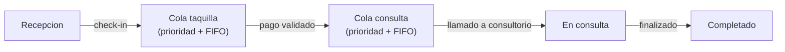

# Operating model

## 1. Purpose

Modelo operativo del flujo clinico de sala de espera. Describe las reglas de prioridad, el modelo de colas por fase, los roles con sus permisos de pantalla y el plan de adopcion por fases.

## 2. Context

El flujo clinico se rige por tres principios fundamentales:

1. **Prioridad clinica primero.** Todo paciente con prioridad Urgent o High se atiende antes que Medium o Low, independientemente del orden de llegada.
2. **FIFO dentro de cada nivel de prioridad.** Pacientes del mismo nivel se atienden en orden de registro.
3. **Cola doble separada por fase.** La cola de taquilla y la de consulta son independientes. Un paciente pasa de una a otra solo tras validar pago.

Orden de prioridad:

| Prioridad | Valor numerico | Significado clinico |
|---|---|---|
| Urgent | 1 | Emergencia: atencion inmediata |
| High | 2 | Alta: condicion critica no inmediata |
| Medium | 3 | Moderada: condicion estable con sintomas |
| Low | 4 | Baja: control rutinario |

## 3. Technical Details

### Modelo de colas

Cada cola mantiene su propio ordenamiento por prioridad + FIFO. El paciente solo avanza de cola tras completar la fase anterior.

### Maquina de estados por fase

#### Fase taquilla

| Estado origen | Accion | Estado destino | Regla |
|---|---|---|---|
| EsperandoPago | `call-next` | LlamadoTaquilla | Prioridad + FIFO |
| LlamadoTaquilla | `validate-payment` | PagoValidado | Pasa a cola de consulta |
| LlamadoTaquilla | `mark-payment-pending` | PagoPendiente | Maximo 3 intentos |
| LlamadoTaquilla | `mark-absent` | ReencoladoTaquilla | Maximo 2 ausencias |
| PagoPendiente | `validate-payment` | PagoValidado | Resuelve pendiente |
| PagoPendiente | `cancel-payment` | Cancelado | Supera limite de intentos |
| ReencoladoTaquilla | `call-next` | LlamadoTaquilla | Vuelve a ser llamado |

#### Fase consulta

| Estado origen | Accion | Estado destino | Regla |
|---|---|---|---|
| EsperandoConsulta | `call-next` | LlamadoConsulta | Requiere consultorio activo |
| LlamadoConsulta | `start-consultation` | EnConsulta | Inicia atencion medica |
| EnConsulta | `finish-consultation` | Completado | Fin del flujo |
| LlamadoConsulta | `mark-absent` | ReencoladoConsulta | 1 reintento, luego cancelado |

### Permisos por rol y pantalla

#### Recepcion

| Capacidad | Permitido |
|---|---|
| Registrar paciente (check-in) | Si |
| Ver cola de espera | Si |
| Llamar siguiente | No |
| Validar pago | No |
| Activar consultorio | No |

#### Taquilla

| Capacidad | Permitido |
|---|---|
| Registrar paciente | No |
| Ver cola de taquilla | Si |
| Llamar siguiente para pago | Si |
| Validar pago | Si |
| Marcar ausencia | Si |
| Cancelar turno | Si |

#### Medico

| Capacidad | Permitido |
|---|---|
| Registrar paciente | No |
| Activar/desactivar consultorio | Si |
| Llamar siguiente para consulta | Si |
| Iniciar consulta | Si |
| Finalizar consulta | Si |
| Marcar ausencia en consulta | Si |

### Plan de adopcion por fases

| Fase | Alcance | Rol cubierto | Estado |
|---|---|---|---|
| 1 - MVP | Check-in + claim-next + complete | Recepcion + medico (flujo directo) | Completado |
| 2 - Flujo taquilla | Cola taquilla + pago + ausencias | Taquilla | Completado |
| 3 - Consultorios | Activacion de consultorios + llamado medico | Medico | Completado |
| 4 - Monitor | Read models + proyecciones + dashboard | Operaciones | En progreso |

### Estado actual vs objetivo

| Dimension | Estado actual | Objetivo |
|---|---|---|
| Endpoints publicados | 22 (comando + query + health) | Estable |
| Roles cubiertos | Recepcion, taquilla, medico | Completo para MVP |
| Read models | 4 (monitor, queue-state, next-turn, history) | Agregar metricas |
| Mecanismo de prioridad | Prioridad clinica + FIFO | Sin cambios planificados |
| Manejo de ausencias | Reintentos con limite + cancelacion | Sin cambios planificados |

## 4. Operational / Maintenance Notes

- Las reglas de prioridad y limites de reintento son invariantes de dominio codificados en el agregado `WaitingQueue`. No se configuran externamente.
- El orden de las colas se determina en la capa de dominio, no en queries SQL.
- La activacion de consultorios es prerrequisito para el llamado medico. Si no hay consultorio activo, `call-next` medico retorna error 400.
